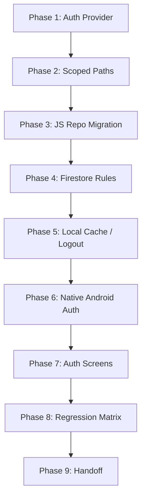

# Multi-User Authentication Audit & Migration Plan

This document details the audit of the current single-user, passcode-only practice notes app and outlines the step-by-step architectural plan to transition it to a production-grade, multi-user application secured by **Firebase Authentication** and **User-Scoped Firestore paths**.

---

## 1. Current Firestore Inventory

The application currently reads and writes to globally shared documents under the Firestore database. Below is the inventory of every path accessed:

| Collection / Document Path | Purpose / Description | Code Files & Functions Using It | Data Shape | Scope | Unsafe for Multi-User? | Target Path under Firebase Auth |
| :--- | :--- | :--- | :--- | :--- | :--- | :--- |
| `reactnativecollection/main` | Stores the main nested JSON notes tree. | - `[notesRepository.ts](file:///c:/Users/khana/OneDrive/Desktop/secondbrain/src/features/sync/notesRepository.ts)`: `subscribeToWorkspaceNotes`, `readWorkspaceNotes`, `writeWorkspaceNotes`<br>- `[OverlayNotesStore.kt](file:///c:/Users/khana/OneDrive/Desktop/secondbrain/android/app/src/main/java/com/notes/nativenotetaking/overlay/OverlayNotesStore.kt)`: `appendNote`, `readFirestoreDocument` | `{ data: NotesData }` where `NotesData` is a tree of categories containing strings or nested single-key category objects. | Global | **Yes.** Overwritten by any client write. No ownership checks. | `users/{uid}/reactnativecollection/main` |
| `reactnativecollection/workspaceslist` | Stores workspace configuration (active workspace name, default name, pins, teleprompter settings). | - `[notesRepository.ts](file:///c:/Users/khana/OneDrive/Desktop/secondbrain/src/features/sync/notesRepository.ts)`: `readWorkspaceIndex`, `subscribeToWorkspaceIndex`, `writeWorkspaceIndex`<br>- `[OverlayNotesStore.kt](file:///c:/Users/khana/OneDrive/Desktop/secondbrain/android/app/src/main/java/com/notes/nativenotetaking/overlay/OverlayNotesStore.kt)`: `togglePinnedCategory`, `readWorkspaceListDocument` | `{ defaultworkspace: string, [workspaceId: string]: string[], pinnedcategories?: Record<string, string[]>, pinnednotes?: Record<string, unknown[]>, teleprompter?: Record<string, any> }` | Global | **Yes.** Pinned categories, settings, and workspace lists are shared globally and conflict between users. | `users/{uid}/reactnativecollection/workspaceslist` |
| `reactnativecollection/reviewledger` | Stores AI review decisions, scores, and settings. | - `[aiReviewRepository.ts](file:///c:/Users/khana/OneDrive/Desktop/secondbrain/src/features/sync/aiReviewRepository.ts)`: `subscribeToAiReviewLedger`, `readLatestAiReviewLedger`, `writeAiReviewLedger` | `{ decisions: AiReviewDecision[], accepted: AiReviewSimpleRecord[], rejected: AiReviewSimpleRecord[], settings: AiReviewSettings, version: number, updatedAt: string }` | Global | **Yes.** Any user gets review recommendations for notes written by other users. | `users/{uid}/reactnativecollection/reviewledger` |
| `reactnativecollection/aiworkspaceindex` | Stores the registry of user-created AI workspaces. | - `[aiWorkspaceRepository.ts](file:///c:/Users/khana/OneDrive/Desktop/secondbrain/src/features/sync/aiWorkspaceRepository.ts)`: `subscribeToAiWorkspaceIndex`, `readAiWorkspaceIndex`, `writeAiWorkspaceIndex` | `{ documents: AiWorkspaceDocumentMeta[], idMap: Record<string, string>, activeDocumentId: string, nextNumber: number, version: number }` | Global | **Yes.** AI workspace lists and configurations leak globally. | `users/{uid}/reactnativecollection/aiworkspaceindex` |
| `reactnativecollection/aimain{number}` | Notes payload for a specific AI workspace. | - `[aiWorkspaceRepository.ts](file:///c:/Users/khana/OneDrive/Desktop/secondbrain/src/features/sync/aiWorkspaceRepository.ts)`: `subscribeToAiWorkspaceNotes`, `readAiWorkspaceNotes`, `writeAiWorkspaceNotes`, `deleteAiWorkspaceNotes` | `{ data: NotesData, updatedAt: string }` | Global | **Yes.** Workspace documents (e.g. `aimain1`) conflict and overwrite across users. | `users/{uid}/reactnativecollection/aimain{number}` |
| `reactnativecollection_notifications/ainotifications` | Registry of scheduled AI notification jobs. | - `[aiNotificationsRepository.ts](file:///c:/Users/khana/OneDrive/Desktop/secondbrain/src/features/sync/aiNotificationsRepository.ts)`: `subscribeToAiNotifications`, `readAiNotifications`, `writeAiNotifications`, `runNotificationTransaction` | `{ jobs: AiNotificationJob[], version: number }` | Global | **Yes.** Job run schedules, content, and notification IDs are mixed globally. | `users/{uid}/reactnativecollection/ainotifications` |

---

## 2. Current Auth Inventory

The application currently has a completely **local-only UI lock gate** with no security protection at the database level.

### Passcode Lock Location
- **Gatekeeper**: `[AuthGate.tsx](file:///c:/Users/khana/OneDrive/Desktop/secondbrain/src/features/auth/AuthGate.tsx)` intercepts startup and monitors app state. If session timeout expires, it locks the app.
- **UI Screen**: `[LockScreen.tsx](file:///c:/Users/khana/OneDrive/Desktop/secondbrain/src/features/auth/LockScreen.tsx)` renders the lock interface.
- **Current Logic**: The lock screen passcode validation is hardcoded to a placeholder:
  ```ts
  if (password === 'c') { ... onUnlock(); }
  ```

### Storage Mechanisms (SecureStore vs. AsyncStorage)
- Currently, **AsyncStorage** is used for lock session management:
  - `rnnotetaking.auth.timeoutHours`: Stores timeout length.
  - `rnnotetaking.auth.lastUnlockAt`: Stores the timestamp of last successful unlock.
- **SecureStore** is currently *not* used for credentials or passwords.

### Security Vulnerabilities
- **UI Gating Only**: The local lock only hides the React Native UI.
- **Open Database**: Firestore security rules (`firestore.rules`) allow anyone with the database URL/project configuration to read/write all collections:
  ```rules
  match /reactnativecollection/{documentId} {
    allow read, write: if true;
  }
  ```
- **No Client Validation**: The database has no idea if the local client is unlocked, let alone who the user is.

### Integration Strategy
After introducing Firebase Authentication:
- **Primary Auth**: Firebase Auth handles user registration, authentication tokens, and user ID verification.
- **Secondary App-Lock (Passcode/Biometrics)**: Retained as a local device-lock mechanism to guard physical access to the UI (without forcing logouts). 
- **Encryption**: The passcode should be hashed and saved in `SecureStore` (replaces hardcoded `c` checks) and can optionally be verified using `expo-local-authentication` (biometrics).

---

## 3. Recommended Multi-User Firestore Schema

To ensure strict data isolation and compatibility with standard Firebase practices, we recommend a user-scoped collection hierarchy:

### 1. Main Notes Document
- **Path**: `users/{uid}/reactnativecollection/main`
- **Fields**:
  - `data` (Map): Simple nested notes JSON.
  - `version` (Number): Schema version (currently `1`).
  - `updatedAt` (Server Timestamp).
- **Owner**: `notes` feature.
- **Android Native R/W**: **Yes.** The native overlay must append notes to this path.
- **Fresh Start**: Default to `{ "data": {}, "version": 1 }`.

### 2. Workspaces Metadata Document
- **Path**: `users/{uid}/reactnativecollection/workspaceslist`
- **Fields**: Workspace maps containing selections, pinned category paths, pinned notes, and teleprompter configurations.
- **Owner**: `categories` / `workspace` features.
- **Android Native R/W**: **Yes.** The native overlay and widget must read default workspace, teleprompter settings, and pinned category paths.

### 3. AI Review Ledger Document
- **Path**: `users/{uid}/reactnativecollection/reviewledger`
- **Fields**: Lists of review decisions, accepted/rejected items, and AI threshold settings.
- **Owner**: `ai` review feature.
- **Android Native R/W**: No. JS only.

### 4. AI Workspace Index Document
- **Path**: `users/{uid}/reactnativecollection/aiworkspaceindex`
- **Fields**: Documents list metadata and active document ID map.
- **Owner**: `ai` workspace feature.
- **Android Native R/W**: No. JS only.

### 5. AI Workspace Main Payload Documents
- **Path**: `users/{uid}/reactnativecollection/aimain{number}`
- **Fields**: `data` (Map Value) containing document notes and `updatedAt` string.
- **Owner**: `ai` workspace feature.
- **Android Native R/W**: No. JS only.

### 6. Scheduled AI Notifications Document
- **Path**: `users/{uid}/reactnativecollection/ainotifications`
- **Fields**: List of notification jobs and version integer.
- **Owner**: `sync` / `ai` notifications feature.
- **Android Native R/W**: **Yes.** The background runner (`aiNotificationRunner.ts` or Kotlin service) must check schedules.

---

## 4. Firestore Rules Strategy

The rules must enforce strict ownership checks by validating that the user ID in the document path matches the token of the authenticated requester.

### Plain English Rules Description
1. Deny unauthenticated reads or writes globally.
2. Require users to be logged in with Firebase Auth.
3. Allow read and write requests on `users/{userId}/...` paths **only** if the requester's `request.auth.uid` matches the `userId` in the document path.
4. Deny all access to legacy root-level collection endpoints (`reactnativecollection`, `reactnativecollection_notifications`, etc.) to prevent data leaks.

### Draft Rules Snippet (`firestore.rules`)
```rules
rules_version = '2';
service cloud.firestore {
  match /databases/{database}/documents {
    // Secure user-scoped data directory tree
    match /users/{userId}/{document=**} {
      allow read, write: if request.auth != null && request.auth.uid == userId;
    }
    
    // Deny all access to legacy global collections
    match /reactnativecollection/{documentId} {
      allow read, write: if false;
    }
    match /reactnativecollection_notifications/{documentId} {
      allow read, write: if false;
    }
    match /reactnativecollection_workspace_notes/{documentId} {
      allow read, write: if false;
    }
    match /reactnativecollection_ai_runs/{documentId} {
      allow read, write: if false;
    }
  }
}
```

---

## 5. Danger / Risk Register

| Risk / Danger | Severity | Likelihood | Mitigation Strategy |
| :--- | :--- | :--- | :--- |
| **Global Path Leakage** | Critical | High | Secure all files to construct paths dynamically using `users/{uid}`. Enforce rules block on root collections. |
| **Passcode UI-only Lock** | Major | High | Ensure Firebase Auth handles cloud database tokens. Repurpose passcode lock to encrypt a local pin in SecureStore for secondary protection. |
| **Native Android REST Saves Bypassing Auth** | Critical | High | Cache the logged-in user's `uid` and Firebase `idToken` in shared preferences. Configure Kotlin connection handlers to inject `Authorization: Bearer <idToken>` headers into HTTP requests. |
| **Cached Data Leakage after Logout** | Major | Medium | Clear all local storage indexes (AsyncStorage caches, local snapshots, AI workspace caches) during the logout procedure. |
| **Multi-User Offline Persistence Cross-contaminations** | Critical | Medium | Before logging in a new user, invoke `firestore.clearPersistence()` to drain queued actions and isolate offline caches. Namespace all AsyncStorage keys using the user's `uid`. |
| **AI review recommendation bleed** | Major | Medium | Move `reviewledger` to a user-scoped document to isolate AI review states and note scoring records. |
| **Data Overwriting on Import** | Major | Medium | Restrict imports/exports to verify active session UID, showing warnings before overwriting the user's specific notes file. |
| **Loose Dev Rules** | Major | High | Test rules locally with the Firebase Emulator Suite. Block global collections in development. |
| **Last-Write-Wins Data Loss** | Medium | Medium | Use transactional increments or document version numbering checks (`version` field) in sync hooks. |
| **1 MiB Document Size Limit** | Medium | Low | Limit large bulk imports. In later phases, migrate from a single nested notes document to subcollections of individual note records. |
| **Sign-Up Abuse** | Medium | Low | Disable anonymous account options if not needed. Enforce email verification or rate limits via Firebase Console. |
| **Exposed Firebase client credentials** | Low | Low | Note that Client API keys are identifiers, not secrets. Firebase security rules are the real defense. Keep Firebase Admin private keys off the device. |
| **Credentials in Version Control** | High | Low | Commit only `.env.example` templates. Keep actual keys in git-ignored `.env` or system variables. |
| **Deep Link Saves Before Auth** | Medium | Medium | Queue incoming deep link commands. Do not apply mutations to the DB until the auth state listener resolves as authenticated. |
| **Lack of Rules Tests** | High | Medium | Write unit tests for rules using the `@firebase/rules-unit-testing` framework. |

---

## 6. Feature Impact Checklist

| Feature Boundary | Impact Description & Necessary Changes |
| :--- | :--- |
| **Auth Screens** | Add SignUp, SignIn, and PasswordReset screens. Integrate with the Firebase Client Auth SDK. |
| **Sync Hook / Repository** | `[useNotesSync.ts](file:///c:/Users/khana/OneDrive/Desktop/secondbrain/src/features/sync/useNotesSync.ts)` and `[notesRepository.ts](file:///c:/Users/khana/OneDrive/Desktop/secondbrain/src/features/sync/notesRepository.ts)` must listen to Auth state. Rebuild hooks to consume the active user's UID to resolve references. |
| **Local Fallback Repository** | Namespace AsyncStorage keys by prefixing them with the logged-in user's UID: e.g., `rnnotetaking.{uid}.notes.main`. |
| **Notes CRUD** | Update target write methods to save directly under the authenticated user path. |
| **Categories / Path Utilities**| No logic changes, but ensure categories are selected from the scoped user's active workspace. |
| **Workspace Metadata** | Rebuild metadata parsing to construct user paths dynamically and prevent namespace collisions on custom workspace titles. |
| **Pinned Categories / Notes** | Save pins in the user-scoped workspaces document. |
| **Search** | Retain logic, searching inside the currently hydrated user notes data. |
| **Import / Export** | Sanitize imports, warn before overwriting the active user's collection, and block writes if session is unauthenticated. |
| **Settings / Logout** | Clear auth states, empty local caches, reset context, clear Firestore persistence, and redirect to the SignIn screen. |
| **AI Chat / Review** | Ensure requests include user context or configuration without exposing shared server tokens. Scopes review recommendations to private user data. |
| **AI Workspace & Notifications** | `[aiNotificationRunner.ts](file:///c:/Users/khana/OneDrive/Desktop/secondbrain/src/features/sync/aiNotificationRunner.ts)` must only fetch/run schedules belonging to the logged-in user. |
| **OCR Save Path** | Send output to the user's active workspace category. |
| **Voice Recorder Save** | Commit transcriptions only to the authenticated user's `VOICENOTES` category. |
| **Deep Links & File Queue** | Buffer deep links until auth state is validated. Block imports if unauthenticated. |
| **Android Native Overlay** | Kotlin REST handlers must read cached `uid` and `idToken` from SharedPreferences, injecting them into HTTP request headers. |
| **Android Widget / Quick Note** | Fallback to offline local SQLite storage if auth token is expired or user is logged out, prompting the user to sign in to sync. |
| **Firestore Rules Deployment** | Deploy secured rules to block root paths and validate user IDs. |
| **Emulator / Testing** | Run Auth and Firestore emulators to test token-based isolation. |

---

## 7. Phased Implementation Plan

This transition will be conducted in modular, testable phases. **No code changes will be made without explicit user approval of the current stage.**



### Phase 1: Firebase Auth Setup & State Provider
- **Files Changing**:
  - `[package.json](file:///c:/Users/khana/OneDrive/Desktop/secondbrain/package.json)` (install firebase/auth package)
  - `[firebase.ts](file:///c:/Users/khana/OneDrive/Desktop/secondbrain/src/features/sync/firebase.ts)` (initialize Firebase Auth instance)
  - `[authContext.tsx](file:///c:/Users/khana/OneDrive/Desktop/secondbrain/src/features/auth/authContext.tsx)` **[NEW]** (create React Context to supply user state: `user`, `uid`, `loading`)
- **Dependencies**: Firebase configuration files.
- **Danger Level**: **Low.** Only adds auth state scaffolding without altering existing notes logic.
- **Verification Steps**: Compile app, typecheck clean, confirm auth listener initializes correctly.
- **Rollback Strategy**: Revert changes to `package.json` and delete the new auth context files.

### Phase 2: User-Scoped Repository Path Abstraction
- **Files Changing**:
  - `[notesRepository.ts](file:///c:/Users/khana/OneDrive/Desktop/secondbrain/src/features/sync/notesRepository.ts)`
  - `[aiReviewRepository.ts](file:///c:/Users/khana/OneDrive/Desktop/secondbrain/src/features/sync/aiReviewRepository.ts)`
  - `[aiWorkspaceRepository.ts](file:///c:/Users/khana/OneDrive/Desktop/secondbrain/src/features/sync/aiWorkspaceRepository.ts)`
  - `[aiNotificationsRepository.ts](file:///c:/Users/khana/OneDrive/Desktop/secondbrain/src/features/sync/aiNotificationsRepository.ts)`
- **Dependencies**: Phase 1 auth state provider.
- **Danger Level**: **Medium.** Updates references and URL resolution functions to expect a `uid` parameter.
- **Verification Steps**:
  - Update signatures to take `uid` parameter.
  - Temporarily pass a default `uid` to confirm existing reads/writes function correctly.
- **Rollback Strategy**: Revert database path helper methods to target static root collections.

### Phase 3: Migrate JS Firestore Reads/Writes to Scoped Paths
- **Files Changing**:
  - `[useNotesSync.ts](file:///c:/Users/khana/OneDrive/Desktop/secondbrain/src/features/sync/useNotesSync.ts)`
  - `[useAiReviewSync.ts](file:///c:/Users/khana/OneDrive/Desktop/secondbrain/src/features/sync/useAiReviewSync.ts)`
  - `[useAiWorkspaceSync.ts](file:///c:/Users/khana/OneDrive/Desktop/secondbrain/src/features/sync/useAiWorkspaceSync.ts)`
  - `[useAiNotificationsSync.ts](file:///c:/Users/khana/OneDrive/Desktop/secondbrain/src/features/sync/useAiNotificationsSync.ts)`
  - `[App.tsx](file:///c:/Users/khana/OneDrive/Desktop/secondbrain/App.tsx)`
- **Dependencies**: Phase 2 scoped paths.
- **Danger Level**: **High.** Rewires sync logic across the app.
- **Verification Steps**:
  - Ensure all database hooks consume `uid` from Auth Context.
  - Check that workspace mutations write to `users/{uid}/...` locations.
- **Rollback Strategy**: Revert hook calls to omit user IDs and write to global documents.

### Phase 4: Firestore Rules & Emulator Tests
- **Files Changing**:
  - `[firestore.rules](file:///c:/Users/khana/OneDrive/Desktop/secondbrain/firestore.rules)`
- **Dependencies**: Phase 3 path modifications.
- **Danger Level**: **High.** Restricts database access.
- **Verification Steps**:
  - Run rules tests locally in Firestore emulator.
  - Deploy rules with `npm run deploy:rules`.
  - Verify unauthorized reads/writes fail while authorized ones succeed.
- **Rollback Strategy**: Restore `firestore.rules` to allow open reads/writes.

### Phase 5: Local Cache / Logout / Offline Isolation
- **Files Changing**:
  - `[localNotesRepository.ts](file:///c:/Users/khana/OneDrive/Desktop/secondbrain/src/features/sync/localNotesRepository.ts)`
  - `[authSession.ts](file:///c:/Users/khana/OneDrive/Desktop/secondbrain/src/features/auth/authSession.ts)`
- **Dependencies**: Phase 3 modifications.
- **Danger Level**: **High.** Risk of data loss if logout routine is buggy or cache files are wiped prematurely.
- **Verification Steps**:
  - Validate AsyncStorage keys contain `uid` prefixes.
  - Log out and confirm all cache keys are empty.
  - Log in with a different user to verify no previous notes carry over.
- **Rollback Strategy**: Revert to global storage keys without UID prefixes.

### Phase 6: Native Android Widget & Overlay Auth Strategy
- **Files Changing**:
  - `[OverlayNotesStore.kt](file:///c:/Users/khana/OneDrive/Desktop/secondbrain/android/app/src/main/java/com/notes/nativenotetaking/overlay/OverlayNotesStore.kt)`
  - `[authSession.ts](file:///c:/Users/khana/OneDrive/Desktop/secondbrain/src/features/auth/authSession.ts)` (add hooks to synchronize token details to SharedPreferences)
- **Dependencies**: Phase 3 paths and Firebase credentials.
- **Danger Level**: **High.** Breakage causes the native overlay or widget to fail on note submission.
- **Verification Steps**:
  - Confirm Kotlin reads correct token and user ID from SharedPreferences.
  - Monitor logs for HTTP REST status codes (verify successful writes).
- **Rollback Strategy**: Revert Kotlin code to use static unauthenticated routes.

### Phase 7: UI Flows (Sign Up, Sign In, Reset, Logout)
- **Files Changing**:
  - `[AuthGate.tsx](file:///c:/Users/khana/OneDrive/Desktop/secondbrain/src/features/auth/AuthGate.tsx)`
  - `[LockScreen.tsx](file:///c:/Users/khana/OneDrive/Desktop/secondbrain/src/features/auth/LockScreen.tsx)` (convert/expand to Auth gate or passcode)
- **Dependencies**: Complete Auth context integrations.
- **Danger Level**: **Medium.** Affects user interaction logic.
- **Verification Steps**:
  - Test registration, email validation errors, password reset routing, and login flow.
- **Rollback Strategy**: Restore passcode-only AuthGate wrapping.

### Phase 8: Regression Test Matrix
- **Files Changing**: None.
- **Dependencies**: All preceding phases.
- **Danger Level**: **Low.**
- **Verification Steps**:
  - Execute exhaustive verification checklists (OCR import, voice recorder, deep links, widgets).
- **Rollback Strategy**: N/A.

### Phase 9: Documentation Update & Handoff
- **Files Changing**:
  - `[plan.md](file:///c:/Users/khana/OneDrive/Desktop/secondbrain/plan.md)`
  - `[CLAUDE.md](file:///c:/Users/khana/OneDrive/Desktop/secondbrain/CLAUDE.md)`
  - `[AGENTS.md](file:///c:/Users/khana/OneDrive/Desktop/secondbrain/AGENTS.md)`
- **Dependencies**: N/A.
- **Danger Level**: **Low.**
- **Verification Steps**: Ensure histories reflect the completed migration.
- **Rollback Strategy**: Revert git commits.

---

## 8. Questions & Blockers Before Implementation

To proceed cleanly, we should align on the following three operational decisions:

1. **Authentication Scope**: Do we require email verification before account activation, or is immediate registration-to-login sufficient for this phase?
2. **Local Lock Persistence**: Should we continue to offer the local passcode lock option (as a PIN screen) *after* the user signs in to Firebase Auth, or does the Firebase login session serve as the sole gatekeeper?
3. **Android Native Token Expiry**: If the Firebase ID Token cached in SharedPreferences expires while the app is closed, should the Kotlin module try to refresh it using the token exchange REST service via a stored refresh token, or fallback to prompting the user to open the React Native app?

---

## 9. Recommended First Implementation Prompt

Copy and paste this prompt when you are ready to begin implementation:

```text
Initialize Phase 1 of the multi-user migration: Set up the Firebase Auth client package, expose the firebaseAuth instance in firebase.ts, and build the React Context AuthProvider in src/features/auth/authContext.tsx to expose (user, uid, loading) to the app. Do not edit rules or database paths yet.
```
